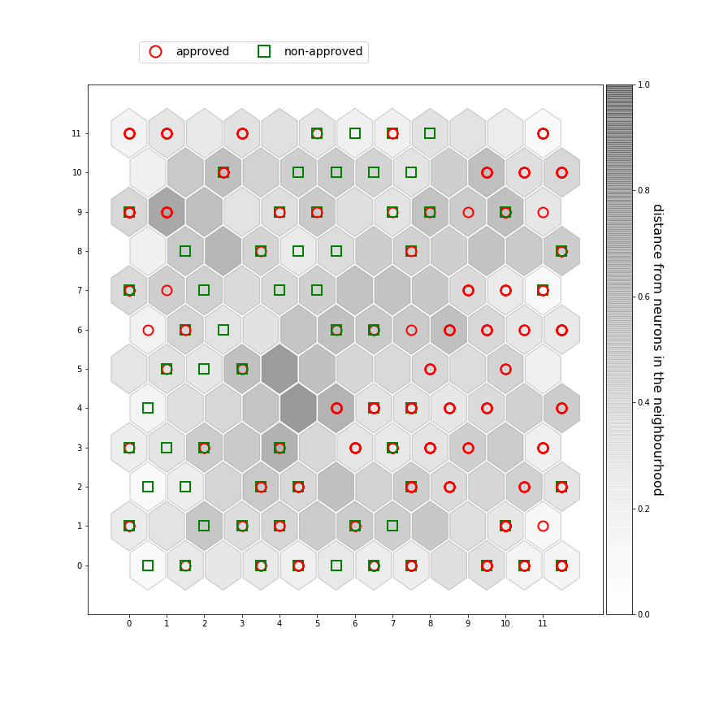

The dataset used here is [Australian Credit Approval Dataset](https://archive.ics.uci.edu/ml/datasets/Statlog+(Australian+Credit+Approval)).

The last feature, which we don't consider for SOM, contains the information whether or not the credit has been approved.

The remaining 14 attributes relate to the credit history of individuals. 

When SOM is applied, it forms different clusters and outliers(i.e. whose distance from neurons in the neighbourhood is too high) can be considered as potential fraudsters. In our SOM architecture, the points mapped to heavily dark hexagons are outliers. 

With the help of last feature, we can make a list of all people who are potential frauds and also got an approval, and investigate further.

